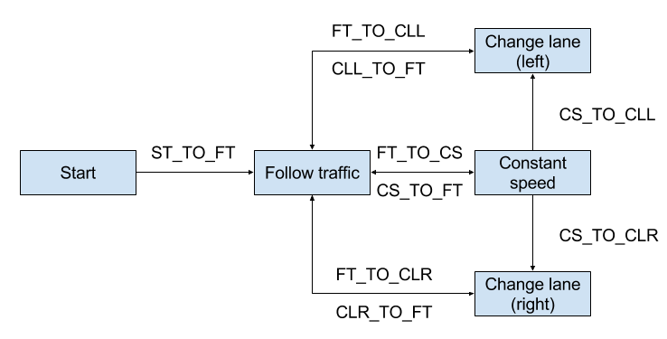

# Behavior and path Planning
[](http://www.udacity.com/drive)
   
Jun Zhu

In this project your goal is to safely navigate around a virtual highway with other traffic that is driving +-10 MPH of the 50 MPH speed limit. You will be provided the car's localization and sensor fusion data, there is also a sparse map list of waypoints around the highway. The car should try to go as close as possible to the 50 MPH speed limit, which means passing slower traffic when possible, note that other cars will try to change lanes too. The car should avoid hitting other cars at all cost as well as driving inside of the marked road lanes at all times, unless going from one lane to another. The car should be able to make one complete loop around the 6946m highway. Since the car is trying to go 50 MPH, it should take a little over 5 minutes to complete 1 loop. Also the car should not experience total acceleration over 10 m/s^2  and jerk over 10 m/s^3.

## Setup and run

Download the [simulator](https://github.com/udacity/self-driving-car-sim/releases/tag/T3_v1.2) which contains the Path Planning Project.

Run the simulator and 

```
mkdir build && cd build
cmake .. && make
./path_planning
```


## Highway map
The map data of the highway is listed in [highway_map.csv](data/highway_map.csv). Each row of the data contains  [x, y, s, dx, dy] values for a waypoint, where x and y are the coordinates in the global coordinate system, s is the longitudinal coordinate along the reference trajectory, dx and dy define the x and y components of the unit vector d which is normal (pointing to the right of the traffic direction) to the referece trajectory.

## Simulator output

#### Main car's localization data (without noise)

["x"] / ["y"] / ["s"] / ["d"] Coordinates in the global coordinate system and Frenet coordinate system.

["yaw"] Yaw angle in degree.

["speed"] Speed in MPH.

Note: these data will not be used except for the initialization of the car's path.

#### Unreached previous path data passed to the planner (not used)

["previous_path_x"] / ["previous_path_y"] Lists of x and y values.

#### End s and d values of  the previous path (not used) 

["end_path_s"] / ["end_path_d"] The last s and d values.

#### Sensor fusion data  (without noise)

["sensor_fusion"] A list other cars' data on the same side of the road in the format [[ID, x (m), y (m), vx (m/s), vy (m/s), s (m), d]]

## Behavior planning

Behavior planning is achieved by using the State (FSM) and Factory Design Patterns, as sketched below. We have two types of FSM: ***state*** (belong to the ego vehicle, e.g. Follow traffic) and ***transition state*** (belong to the ***state***, e.g. FT_TO_CS). The ego vehicle can only occupy one ***state*** at any time but the ***state*** can have several ***transition states***. At each time step, the ***transition states*** of the current ***state*** are checked one by one. If any transition is valid, the vehicle will switch to the next ***state*** that this ***transition state*** leads to.



## Path planning

Path planning can be divided into two steps: 
1. Estimate the final motion state (s, d, speed, etc.) of the ego vehicle based on the current motion state of the ego vehicle and the surrounding vehicles. Collision check is also done in this step.
2. Generate several [jerk minimizing trajectories](http://ieeexplore.ieee.org/document/5509799/) by jittering the the final motion state. Then a brute force search is applied to select the trajectory with the minimum cost (a function of average speed, maximum speed, maximum acceleration, maximum jerk, etc.).

## Videos

Solution for the project.

[](https://youtu.be/lbwL3iqhXzE)

Increase the speed to 85 MPH. More exciting!

[](https://youtu.be/7MIDTK7BHy4)


