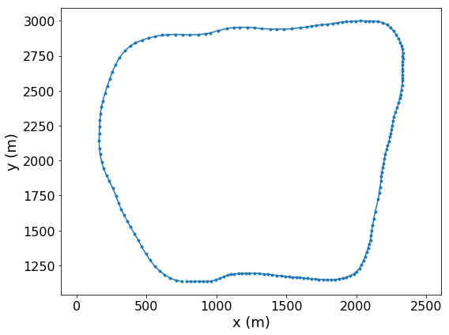

# Behavior and Path Planning
[](http://www.udacity.com/drive)
   
Jun Zhu

In this project, the goal is to safely navigate around a virtual highway with 
other vehicles that are driving +-10 MPH of the 50 MPH speed limit. You will be 
provided the car's localization and sensor fusion data, there is also a sparse 
map list of waypoints around the highway. The car should try to go as close as 
possible to the 50 MPH speed limit, which means passing slower traffic when 
possible, note that other cars will try to change lanes too. The car should 
avoid hitting other cars at all cost as well as driving inside of the marked 
road lanes at all times, unless going from one lane to another. The car should 
be able to make one complete loop around the 6946 m highway. Since the car 
is trying to go 50 MPH, it should take a little over 5 minutes to complete 1 
loop. Also the car should not experience total acceleration over 10 m/s^2 and 
jerk over 10 m/s^3.

## Dependencies

- [uWebSockets](https://github.com/uNetworking/uWebSockets) **v0.14.8**

## Setup and run

Download the [simulator](https://github.com/udacity/self-driving-car-sim/releases/tag/T3_v1.2) which contains the Path Planning Project.

Run the simulator and 

```
$ mkdir build && cd build
$ cmake .. && make -j4
# It is required to run the app in a directory which can find the map file in "../../data/MAP_FILE".
$ cd src
$ ./run_app
```

## Highway map
The map data of the highway is listed in [highway_map.csv](data/highway_map.csv). Each row of the data contains  [x, y, s, dx, dy] values for a waypoint, where x and y are the coordinates in the global coordinate system, s is the longitudinal coordinate along the reference trajectory, dx and dy define the x and y components of the unit vector d which is normal (pointing to the right of the traffic direction) to the reference trajectory.



## Simulator output

* Localization data (without noise)
  - ["x"] x in the Cartesian coordinate system, m
  - ["y"] y in the Cartesian coordinate system, m
  - ["s"] s in the Frenet coordinate system, m
  - ["d"] d in the Frenet coordinate system, m
  - ["yaw"] yaw angle, degree
  - ["speed"] speed, MPH

* Sensor fusion data  (without noise)

  - ["sensor_fusion"] A list other cars' data on the same side of the road in 
  the format [[ID, x (m), y (m), vx (m/s), vy (m/s), s (m), d (m)]]

* Unprocessed previous path data passed to the simulator (not used)

  - ["previous_path_x"] lists of unprocessed x coordinates, m
  - ["previous_path_y"] lists of unprocessed y coordinates, m

* End point of the previous path (not used) 

  - ["end_path_s"] s in the Frenet coordinate system, m
  - ["end_path_d"] d in the Frenet coordinate system, m

## Behavior planning

Behavior planning is achieved by using the FSM pattern:

**Start Up** -> **Keep Lane** <-> **Change Lane** 


## Path planning

The following strategy is applied in searching the optimized path:

- Estimate the feasible final dynamics (s, d, speed, etc.) of the car in a given
state;
- Greedily search the [jerk minimizing trajectories](http://ieeexplore.ieee.org/document/5509799/) 
which takes the shortest time and has the shortest distance;
- Collision check is applied in the **Change Lane** state. If a collision could
happen for the planned path, the car will keep going in the current lane. If 
a valid path can not be found after a certain time, it will switch back to the
**Keep Lane** state.


## Videos (to be updated...)

[](https://youtu.be/lbwL3iqhXzE)

Increase the speed to 85 MPH. More exciting!

[](https://youtu.be/7MIDTK7BHy4)


